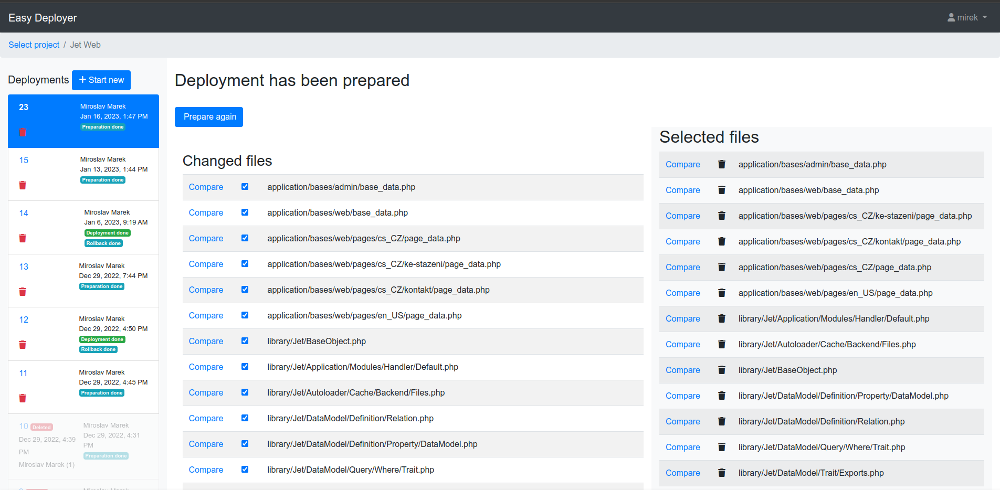

# Easy Deployer

Easy Deployer is easy to use, but very powerful online projects deployment tool. It uses FTP or SCP/SFTP for file transfer.

Main features:

* Creates backup before deployment process
* Shows diff - side by side changes comparator
* Evidence of all performed operations
* Rollback possibility!
* Fast deployment just by easy clicking
* Multiple project 
* Multiple users
* Multiple teams
* Advanced access control
* Simple web based user interface
* Easy installation

This application is based on [PHP Jet framework](https://github.com/mirekmarek/php-jet) and lightly modified [PHP Diff library](https://github.com/chrisboulton/php-diff).

## Requirements

* Some web server (non-public!) running PHP 8.0 and newer (your development and testing server, or your localhost)
* MariaDB / MySQL or SQLite support
* PHP INTL (mostly standard PHP module)
* PHP PDO (mostly standard PHP module)
* PHP mbstring (mostly standard PHP module)
* PHP OpenSSL (mostly standard PHP module)
* PHP FTP extension (easy to install extension)
* PHP SSH2 extension (easy to install extension)

## Installation
* Download package
* Unpack package into the webserver document directory
* Open URL of your webserver in a browser
* Follow the installer's instructions